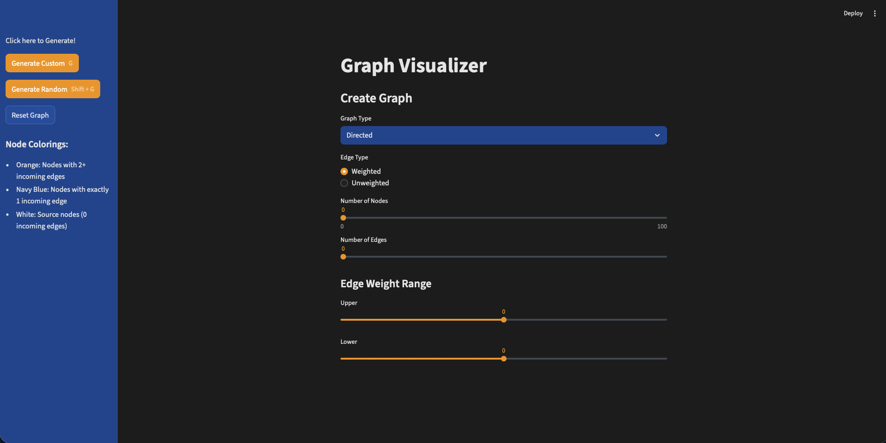
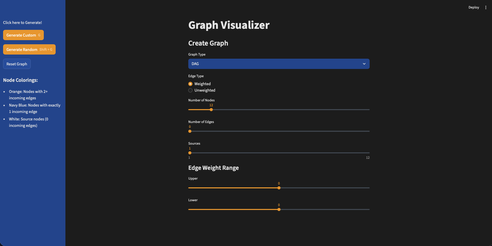
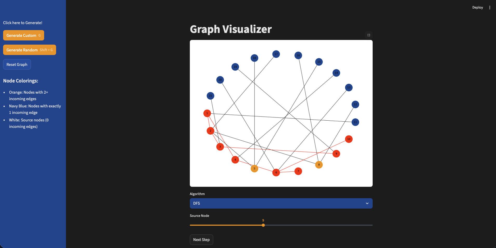
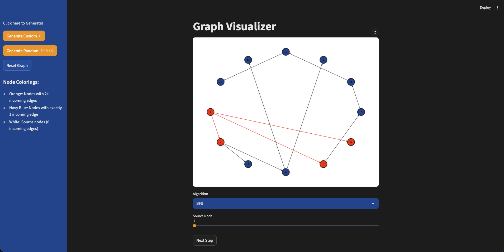
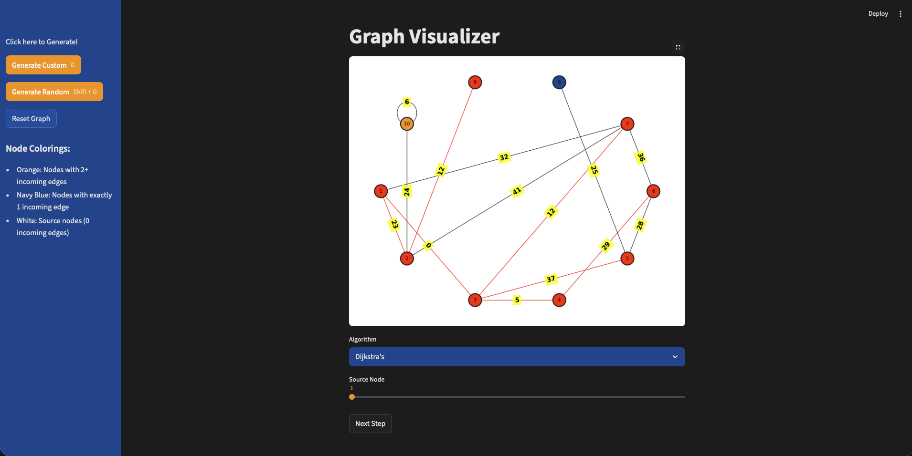
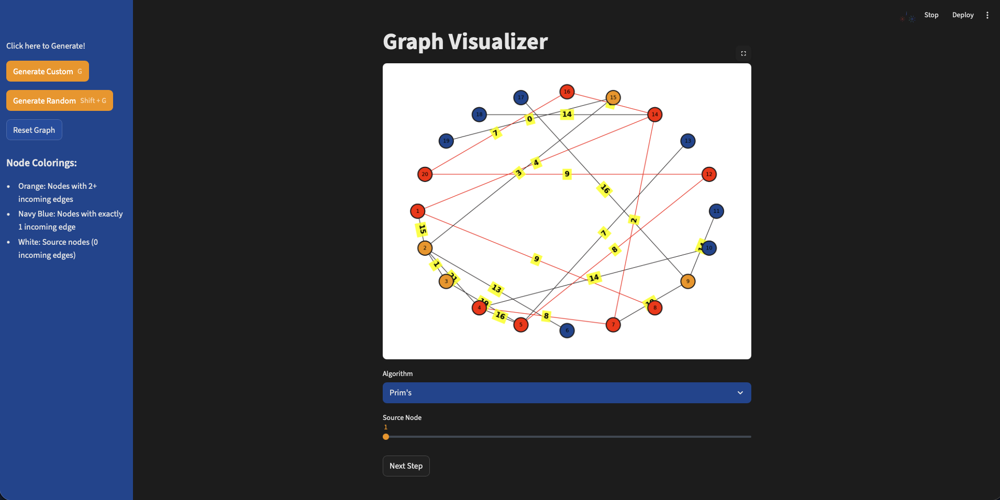

# alg-vis
Application that visualizes graphs and their algorithms. After taking my Advanced Programming and Data Structures course, I wanted to explore building a small visualization app. In this project I was able to learn Python from my previous Java experience and take my first shot at working with a front end interacting with a Python backend.

## Features
- **Graph Generation**: Create custom or random graphs (directed, undirected, or DAGs)
- **Weighted/Unweighted Edges**: Support for both weighted and unweighted graph types
- **Spanning Options**: Generate graphs that span all nodes or allow disconnected components
- **Step-by-Step Visualization**: Watch algorithms execute one step at a time with node and edge coloring
- **Multiple Algorithm Support**: Visualize DFS, BFS, Dijkstra's, and Prim's algorithms

## Algorithms

### Depth First Search (DFS)
- Recursively traverses graph
- Traverses deep (furthest nodes) first, then 'retraces' steps back to source
- Maintains `marked`, `dist_to`, and `edge_to` arrays
- **Use case**: Detecting cycles, topological sorting, finding connected components

### Breadth First Search (BFS)
- Explores graph level-by-level using a queue
- Visits all neighbors at current depth before moving deeper
- Guarantees shortest path in **unweighted graphs** (by number of edges)
- Maintains `marked`, `dist_to`, and `edge_to` arrays
- **Use case**: Finding shortest paths in unweighted graphs, web crawling

### Dijkstra's Algorithm
- Finds shortest paths from source to all nodes in **weighted graphs**
- Uses a priority queue to always process the node with minimum distance
- Only works correctly with **non-negative edge weights**
- Maintains `dist_to` and `edge_to` arrays
- **Use case**: GPS navigation, network routing, finding cheapest flight paths

### Prim's Algorithm
- Builds a Minimum Spanning Tree (MST) for **weighted, undirected graphs**
- Greedily selects the minimum weight edge connecting tree to non-tree nodes
- Guarantees minimum total edge weight to connect all nodes
- Maintains `mst_edges` list showing selected edges
- **Use case**: Network design, clustering, approximating traveling salesman problem

## Visualization

### Node Color Coding
- **Orange**: Nodes with 2+ incoming edges
- **Navy Blue**: Nodes with exactly 1 incoming edge  
- **White**: Source nodes (0 incoming edges)
- **Red**: Visited/processed nodes (during algorithm execution)

### Edge Color Coding
- **Black**: Default/unvisited edges
- **Red**: Edges used in the search path or spanning tree

## Screenshots

### Graph Creation Interface
##### Non Weighted Directed/Undirected:


##### Weighted Directed/Undirected:


##### DAG:

*Screenshot of the graph creation interface with options for graph type, nodes, edges, and weights*

### DFS Visualization

*Depth First Search in progress, showing the recursive traversal pattern*

### BFS Visualization

*Breadth First Search exploring nodes level by level*

### Dijkstra's Algorithm

*Dijkstra's algorithm finding shortest paths in a weighted graph*

### Prim's MSTprim

*Prim's algorithm constructing a Minimum Spanning Tree*

## Installation
```bash
# Clone the repository
git clone https://github.com/yourusername/alg-vis.git
cd alg-vis

# Install dependencies
pip install -r requirements.txt

# Run the application
streamlit run app.py
```

## Usage

1. **Create a Graph**:
   - Select graph type (Directed, Undirected, or DAG)
   - Choose weighted or unweighted edges
   - Set number of nodes and edges
   - Optionally enable spanning to ensure connectivity

2. **Run an Algorithm**:
   - Select an algorithm from the dropdown
   - Choose a source node
   - Click "Begin" to start visualization

3. **Step Through Execution**:
   - Click "Next Step" to advance through the algorithm
   - Watch nodes and edges change color as they're processed
   - View final results when algorithm completes

## Technologies Used
- **Python**: Core programming language for backend and algorithm logic
- **Streamlit**: Web application framework for the frontend
- **NetworkX**: Graph data structure
- **Matplotlib**: Graph visualization and rendering

## Main Project Structure
```
alg-vis/
├── app.py                 # Main Streamlit application
├── algorithms/
│   └── algs.py           # Algorithm implementations (DFS, BFS, Dijkstra's, Prim's)
├── graphs/
│   ├── graph_utils.py    # Graph generation and display logic
│   └── constants.py      # Graph type constants
└── requirements.txt      # Project dependencies
```

## Limitations and Potential Additions
-> Custom graph creation is impossible 
-> More Algorithms could be added

## Acknowledgments
Built as a learning project to explore graph algorithms, Python development, and AI tool usage after completing CS62: Advanced Programming and Data Structures course at Pomona College.

---